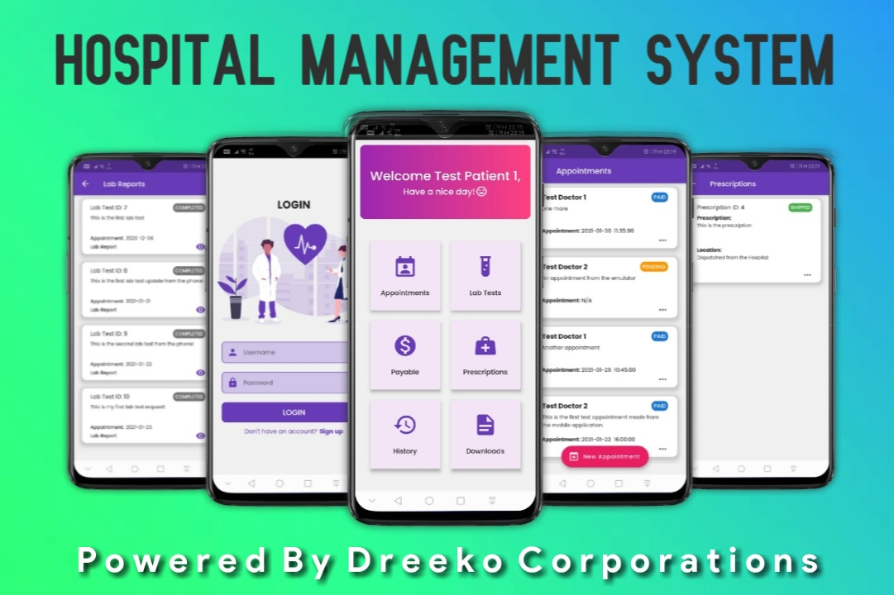
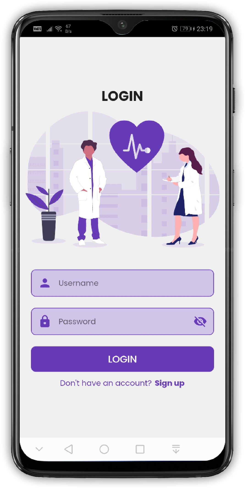
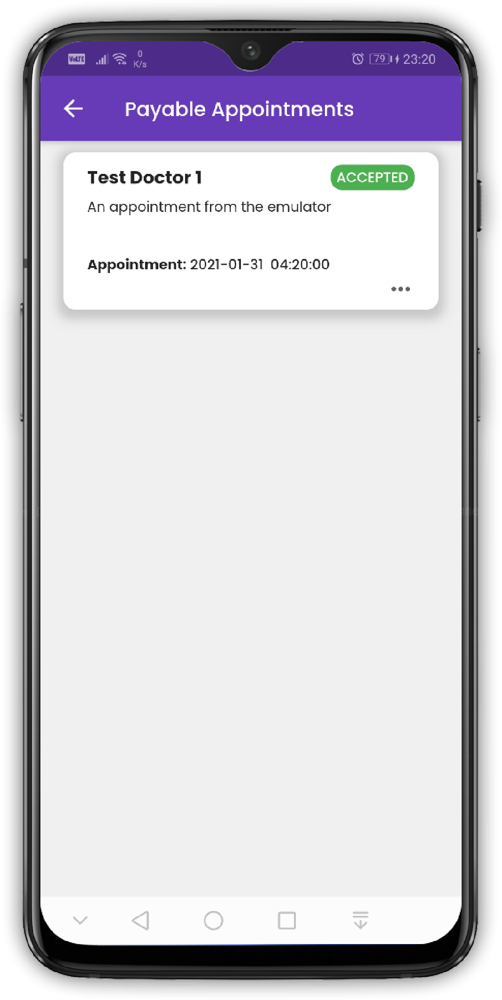
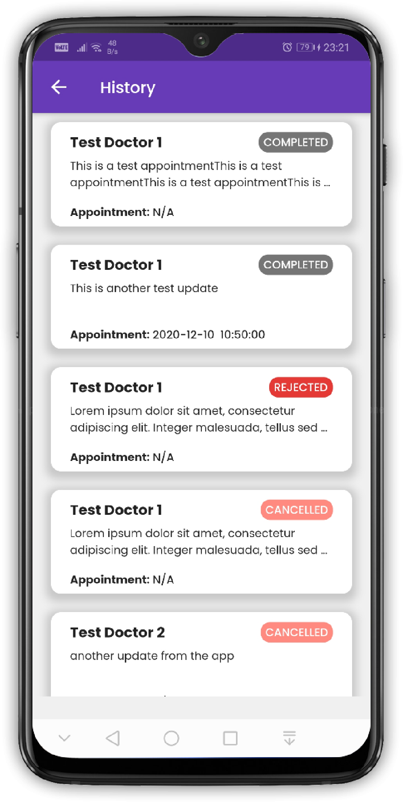
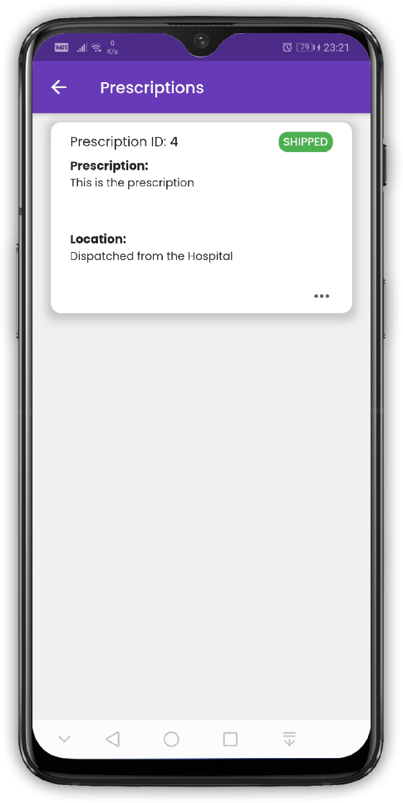
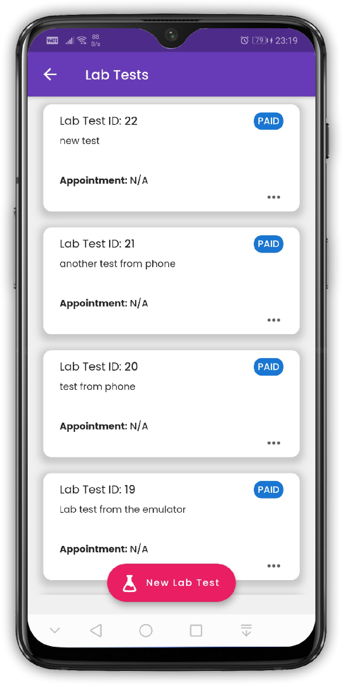
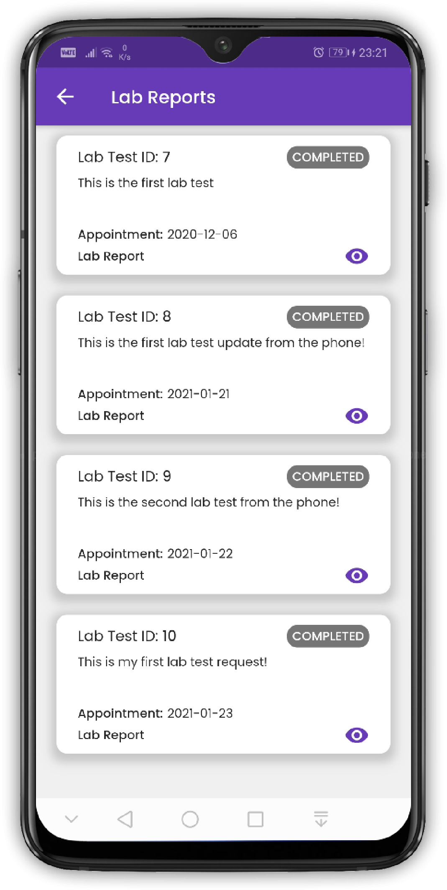

<h1 align="center">Welcome to Hospital Management System 👋</h1>

<p align="center">
  
  <a>
    
  </a>
  <a>
    
  </a>
  <a href="http://makeapullrequest.com">
    
  </a>
  <a href="https://linkedin.com/in/mushlihun">
  
  </a>
</p>

**_Star ⭐ the repo if you like what you see. 😎_**



> **_A Hospital Management System made with Flutter to help you make doctor's appointments and lab appointments during this Covid-19 Era._**

## 👷‍♂️ Built With

- [Flutter](https://flutter.dev)
- [PHP](https://www.php.net/)
- [Stripe API](https://stripe.com/en-gb-us)

## ✨ Requirements

- Any Operating System (ie. MacOS X, Linux, Windows)
- Any IDE with Flutter SDK installed (ie. IntelliJ, Android Studio, VSCode etc.)
- A little knowledge of Dart and Flutter
- The Hospital Management System web application [Click here](https://github.com/mushlihun/hospitalapps)

```
> ℹ Additional information

- The above steps will work fine if you are using a real device. However, if you want to use an emulator, follow these additional steps to setup the environment properly.
- Open up the cloned repository in your desired IDE and locate the `NetworkHelper.dart` file.
- Find the following lines,

```dart
  // for real device
  final String url = "http://0.0.0.0:8000/api";

  // for emulator
  final String url = "http://10.0.2.2:8000/api";
```

> _Real devices reffer to the `localhost` as `0.0.0.0`. Emulators reffer to the `localhost` as `10.0.2.2`._

- By default, the application is set to be run on a real device. Therefore, the URL for the emulator localhost has been commented out.
- Uncomment it and comment the URL for the local device and run the application on an emulator.
- Also, remember to run the previously mentioned `ADB` commands before running the application on an emulator.
- Change this URL setting whenever you want to run on a real device or an emulator.

- The above URL change should be done in the `LabReports.dart` file as well.
- Locate the following code within the file.

```dart
  // for real device
  final String pdfBaseUrl = 'http://0.0.0.0:8001/lab-reports';

  // for emulator
  final String pdfBaseUrl = 'http://10.0.2.2:8001/lab-reports';
```

- Again the URL for emulators will be commented out by default. Uncomment it to access the `PDF` files from the emulator.
- Sometimes the emulator might not be able to access the PDF files.
- Disable the `proxy` from the emulator if that happens and apply `No Proxy` setting.
- Then the application will work without any errors but sometimes it might display a `connection closed` error randomly.

## 📸 Screenshots

&nbsp;&nbsp;&nbsp;&nbsp;&nbsp;&nbsp;&nbsp; &nbsp;&nbsp;&nbsp;&nbsp;&nbsp;&nbsp;&nbsp; &nbsp;&nbsp;&nbsp;&nbsp;&nbsp;&nbsp;&nbsp;  </br> </br> </br>
&nbsp;&nbsp;&nbsp;&nbsp;&nbsp;&nbsp;&nbsp; &nbsp;&nbsp;&nbsp;&nbsp;&nbsp;&nbsp;&nbsp; &nbsp;&nbsp;&nbsp;&nbsp;&nbsp;&nbsp;&nbsp; 

## 🤓 Author

**Mushlihun**
<br>


<br>

## 🤝 Contributing

**Contributions, issues and feature requests are welcome** !<br />Feel free to check out the [issues page]().

## 📝 License


- **[MIT license](http://opensource.org/licenses/mit-license.php)**
- Copyright 2020 © <a href="http://fb.com/DreekoCorporations" target="_blank">Dreeko Corporations</a>

## 🌍 Hospital Management System Web Application

`https://github.com/mushlihun/hospitalapps`